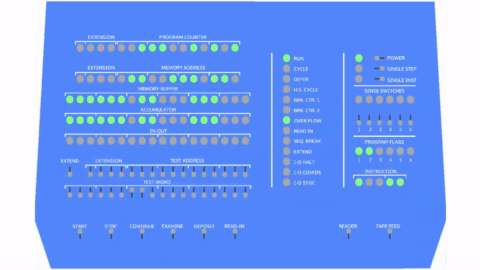
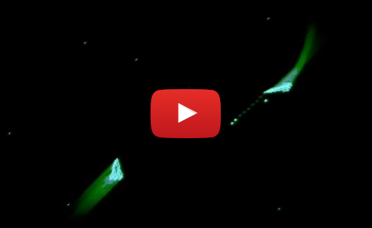
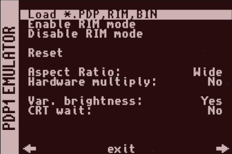
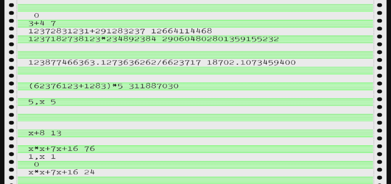
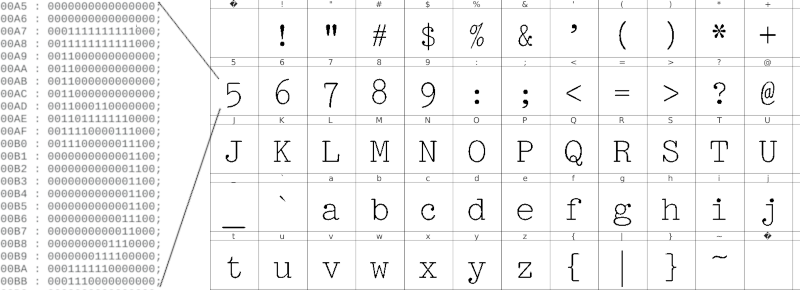
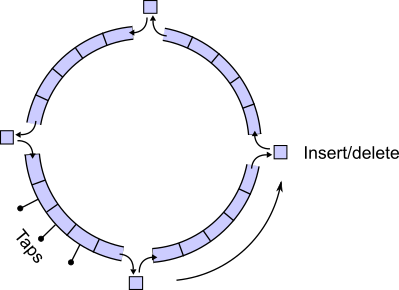
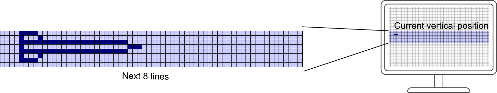
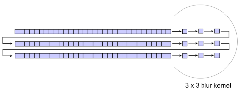

# FPG-1 is a PDP-1 implementation in FPGA

DEC PDP-1 is a computer designed and produced in 1959. Considering the pace of change in computing, that might seem like the prehistoric age. However, it is also surprisingly modern and proves a point that the basic concepts still withstand the test of time.

This project is trying to re-create this computer in FPGA and enable **running the first real computer game, SpaceWar!, on a modern display and gamepad**. It is designed to run on the [MiSTer](https://github.com/MiSTer-devel/Main_MiSTer/wiki) platform, a retro gaming system based on the [Terasic DE10-Nano](http://de10-nano.terasic.com) FPGA board.

The implementation is done in Verilog, a hardware description language specifying the structure and behavior of digital logic circuits. This is not a software emulation because there is no CPU executing it.

Since this is my first Verilog project ever and its purpose was to teach myself about FPGA, don't expect too much. Beginners often make mistakes or break best practice. Please keep this in mind. Advice and suggestions are welcome!

This image is made by recording video output from the FPGA board.

## Features

- PDP-1 instruction set
- 4 kB of core memory
- Console visualization
- Paper tape reader
- Read-in mode support
- Type 30 CRT emulation
- Teletype emulation
- Configurable hardware multiply
- Single step mode
- Original core for MiSTer

## Click on the image to watch a video demonstration

## Install

Copy .rbf to the root of your SD card and load it. Spacewar! is preloaded in memory and will launch immediately. Any other software you will need to load as a paper tape image from the OSD menu.

[Graphics filters](https://github.com/MiSTer-devel/Filters_MiSTer) are supported. Feel free to try them out and further tweak the graphics to your preference.

## Loading paper tape image

First, copy the paper tape image to your SD card. To load it, you first need to select RIM (read-in mode) enable by pressing F10 or from the F12 menu. Then select first option, **load** and select your file.

## Keyboard shortcuts

* F1 - Power on/off
* F2 - Toggle active switch row on the console view. This positions the cursor on the first switch in the row. Move left-right with numeric keyboard arrows and toggle switch with enter.
* F3 - Single instruction switch toggle
* F4 - Cycle between CRT output, Console output and Teletype.
* F5 - Start
* F6 - Stop
* F7 - Continue
* F8 - Examine
* F9 - Deposit
* F10 - Enable read-in mode
* F11 - Tape feed
* F12 - MiSTer OSD menu

Additional keyboard mappings for the teletype emulation can be found in keyboard.v.

## OSD menu options

* **Load PDP, RIM, BIN** - loads paper tape images
* **Enable RIM mode** - enables the "bootloader" mode
* **Disable RIM mode** - leave the RIM mode
* **Reset** - set the registers to initial state, doesn't clear memory
* **Aspect ratio** - Tell scaler to select 16:9 or leave the original 5:4 aspect ratio.
* **Hardware multiply** - Early PDP-1 had no hardware multiply, later ones did. The instruction was not changed,
so the same opcode was used. That's why it needs to be selected to match the program being executed.
* **Var. brightness** - Type 30 CRT could specify brightness intensity for pixels. This can be turned off for some intensive
graphics demos (snowflake).
* **CRT wait** - Type 30 CRT needs about 50 microseconds before another pixel can be accepted. If your code takes less than that, you will have to wait or lose pixels. This is not the case with a modern LCD so this limitation can be overriden.

## Gamepad configuration

You can immediately use up/down/left/right as fire/thrust/left/right or you can reconfigure it through MiSTer OSD menu. Run the OSD menu with F12, press right and select configure joystick. Then it will ask you to press keys for left, right, thrust, fire and hyperspace.

## Implementation details

### CPU implementation

The CPU itself is implemented by reading the PDP [manual](http://www.bitsavers.org/pdf/dec/pdp1/F15D_PDP1_Handbook_Oct63.pdf) and trying to make instructions perform like the original in the specified amount of time. It runs and passes the instruction test tapes, except for the features not yet implemented (extended memory, sequence break system).

### Teletype implementation

Screen is divided into a 64 x 32 pixel matrix, and each field contains one character. To store this data, a 2048 byte RAM is instantiated. As lines are drawn for each frame, the read address is changed when the horizontal counter "jumps" from one grid element to the next. Each character is then looked up in the ROM, depending on the value read and the grid element line number we are currently plotting.

There is a character set ROM and a frame buffer RAM. After choosing a suitable font which was used on IBM typewriters of the day (and on a Soroban PDP console teletype), it was exported to individual bitmaps and processed with Python image library to produce a memory image format file. This file is stored in ROM and looked up to draw individual characters.

### Type 30 CRT implementation

One of the most difficult tasks to emulate is the Type 30 CRT. The CRT used for the PDP-1 was a radar screen with P7 phosphor coating and has quite a long persistence - probably chosen to counter the relatively low frequency of writing pixels. Type 30 CRT had a resolution of 1024 x 1024, which is basically full HD (and 60 years ago!). However, a pixel write took 50 microseconds so the number of pixels could not exceed 20 000/second. A CRT computer monitor from the nineties could write, let's say 1024 x 768 @ 60 Hz - 47 million pixels a second. Quite a difference! For 25 frames per second, the Type 30 CRT has at most 800 pixels per frame. That's why Spacewar! is mostly black! :)

The computer interfaces the CRT through the IOT command, by placing the X and Y coordinates in AC and IO registers and specifying brightness and screen coordinate mode in the instruction itself. The output should accommodate a modern raster LCD screen, so some conversion is required. This module is a probably way over-complicated, but it was done for educational purposes. It features a 1280 x 1024 @ 60 Hz output which can be scaled to desired resolution.

It uses several M10K altsyncram instances to provide memory storage. To simulate phosphor decay, a classic straightforward approach would require at least 1024 x 1024 (DEC Type 30 CRT resolution) pixels x 8 bit per pixel = 8 Mbits of memory. Cyclone V on the DE-10 Nano (5CSEBA6U23I7) has 5,5 Mbits, and this would imply using the SDRAM. However, SDRAM was too difficult for me at this speed because one must accommodate for the refresh period.

Pixels are kept as a 32 bit value in a ring of 4 chained shift registers, with their X and Y coordinates (10 bits each) and remaining brightness (12 bits). At each splice point, pixels are aged - their brightness gets decremented until they are no longer visible. Each shift register has 8 taps used to determine if there is an existing pixel inside with matching coordinates which needs updating. Because of the tap spacing, it will take *n*/8 to determine if there is a pixel to update and, at worst, a full *n* clock cycles to update the pixel where *n* is the shift register length.

There is also a row buffer implemented. It buffers the next 8 rows and fills them with pixels seen at the shift register taps whose Y coordinate matches one of the buffer rows. As the current top row is read, it's erased and becomes the new bottom row when the vertical counter advances.

To complicate a little more, there is additional blur circuitry. Without it, the image would be too sharp and unrealistic. Bright pixels are not affected to allow more detail and blur is applied as they age and diminish in brightness.

That calls for another set of 3 shift register chained in serial to represent 3 rows of pixels, and additional 3 registers per shift register as individual pixels. This makes a 3x3 matrix for convolution with a blur kernel.

Variable brightness implementation is not very elegant at the moment - it adds 4 more pixels next to the one marked as bright. That creates the effect of greater phosphor light emission and a bigger dot, but uses more memory.

### Console implementation

Console was implemented by drawing the background in a vector drawing program (Inkscape) to mimic the look of PDP-1 original console. It was then converted to a 1-bit black and white image and written to a console background ROM as a memory image file.

The light bulbs were implemented as lookup tables for drawing circles of certain color. Only the first quadrant is looked up to reduce the list size, and the other 3 quadrants are shifted as needed. The color is determined depending if the bit the bulb represents is a logical high or low.

Switches are drawn in a similar manner, with holes being a simple black lines and the knobs smaller circles. The cursor for marking the position of active knob simply changes the knob color. There are no two values with the same Y coordinate, and that's the idea used to tell the active registers apart.

Switches on the bottom row are drawn individually and are controlled by function keys on the keyboard. Everything is layered so that the background image is drawn in the lowest layer, and bulbs / switches are drawn on top of it.

### Settings and tips for running software

* **EDC** - Expensive Desk Calculator; provided as edc.rim in paper_tapes folder, it requires hardware multiply to be disabled. After it's loaded, press tab few times on the teletype emulation screen. Try entering e.g. 8 - 3 and pressing tab to get the result. Some documentation can be found [here](http://www.computerhistory.org/pdp-1/_media/pdf/DEC.pdp_1.1963.102664262.pdf)

* **Snowflake** - Hardware multiply should be on, variable brightness off, CRT wait if desired. Load and watch the demo.

* **Minskytron** - You need to set the test word switches before running, one suggested setting is "110 111 111 111 010 001".

* **DDT** - Load and check the [usage manual](http://archive.computerhistory.org/projects/pdp-1/text/DEC.pdp_1.1964.102650078.pdf) from computerhistory.org

* **Spacewar 4.1** - Hardware multiply on, variable brightness on, CRT wait is not needed.

* **Spacewar 2B** - Earliest version of the game known to exist, not yet finished. Hardware multiply off, the rest of settings like spacewar 4.1

### FAQ

##### Q. Program doesn't load properly

A. Is the RUN light on? It has to be. RIM loader first loads a small portion of code which then loads the rest of the program. If the cpu is stopped, the bootloader cannot execute and the rest cannot be loaded.

Try loading once more, first load attempt sometimes fail and I have yet to discover why.

##### Q. There is a problem with video output

A. This core uses the new open source video scaler for MiSTer. First try upgrading MiSTer to the latest version, then consider creating a [MiSTer.ini](https://github.com/MiSTer-devel/Main_MiSTer/blob/master/MiSTer.ini) file in the config folder of your SD card and try choosing video_mode=4 (1280x1024@60).

##### Q. Video geometry is wrong

A. Try switching the aspect ratio from OSD (press F12 to access it).

##### Q. Where do I find more documentation about the PDP-1 ?

A. Check [bitsavers pdf section](http://www.bitsavers.org/pdf/dec/pdp1/).

##### Q. Where do I find more software ?

A. Try [bitsavers paper tape images](http://bitsavers.org/bits/DEC/pdp1/papertapeImages/).

##### Q. <something> is missing

A. I know, it's not yet entirely accurate. Hopefully, the next revision will get closer to the original.

##### Q. Why did you do this?

A. It's a hobby.

##### Q. Graphics suck, Fortnite is much better

A. You might not be the target audience. :-)

## Known issues and missing features

- Missing RPA instruction for reading ascii from paper tape
- Missing paper tape punch (for saving files)
- No SBS or extended memory yet
- Indirect addressing could have more accurate timing
- IOT doesn't have proper synchronous handling circuit
- CRT needs a better blueish color for bright pixels
- CRT needs exponential decay rather than linear
- Not all status lights are implemented on the console
- Load sometimes needs to be attempted twice

## License

This software is licensed under the MIT license.

## Credits

Thanks to [Norbert Landsteiner](https://www.masswerk.at/spacewar/) for his expertise, help and guidance.

Thanks to [Alexey Melnikov - Sorgelig](https://github.com/MiSTer-devel/Main_MiSTer/wiki) for helping out with FPGA and MiSTer APIs.

Thanks to [Lyle Bickley](https://www.youtube.com/watch?v=1EWQYAfuMYw) for providing advice and inspiration.

Thanks to [Ben Gurley](https://en.wikipedia.org/wiki/Ben_Gurley) (1926-1963), the engineer who designed PDP-1 in 3 months. His tragic fate was a great loss to computer science and engineering.
